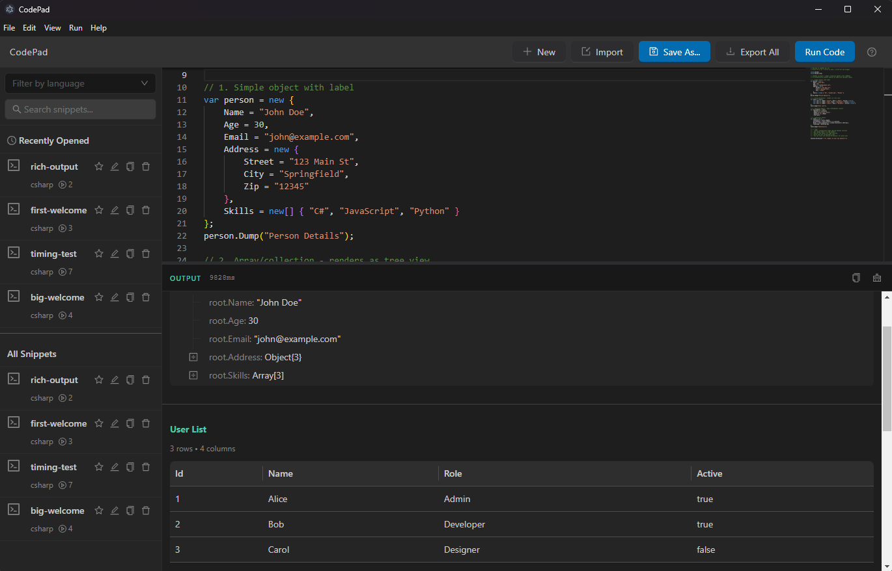

# CodePad

A cross-platform code scratchpad and rapid prototyping tool inspired by LINQPad. Execute code snippets across multiple programming languages without the overhead of creating full projects.



## Quick Start

### Installation

1. **Download** the latest release for your platform from [Releases](https://github.com/treytomes/code-pad/releases)
2. **Install .NET SDK 8.0+** if not already installed: [Download .NET](https://dotnet.microsoft.com/download)
3. **Extract and run** the CodePad executable

### First Run

1. **Create a new snippet** - The editor opens with a sample demonstrating the `.Dump()` extension
2. **Press F5** to execute the code
3. **View output** in the bottom panel - Results appear in real-time as code runs
4. **Save your work** - Press Ctrl+S or click the Save button

### Key Features

- **LINQPad-style .Dump()** - Automatically format objects as JSON with labels
- **Samples Tab** - Explore 12 built-in examples organized by category
- **Instant Execution** - No project setup, no build configuration
- **Smart Window State** - Size, position, and maximized state persist across restarts

## Features

### ✅ v0.1.0 - Pre-Release (Complete)

#### Code Execution
- **C# code execution** using `dotnet build` (no external tools required)
- **LINQPad-style .Dump()** - Format objects as JSON with optional labels
- **Configurable timeout** - Set execution limit or disable (run indefinitely)
- **Stop button** - Cancel long-running executions immediately
- **Real-time output streaming** - See results as code runs
- **Execution timing** - Live millisecond counter

#### Snippet Management
- **Full CRUD operations** - Create, save, update, delete snippets
- **Starred favorites** - Mark important snippets
- **Recently opened** - Quick access to last 5 snippets
- **Search & filter** - Find snippets by name
- **Unsaved changes tracking** - Visual indicator and warnings
- **Import/Export** - Share .cs files or backup to JSON

#### Samples & Learning
- **12 built-in samples** organized into 4 categories:
  - Getting Started (3 examples)
  - .Dump() Extension (4 examples)
  - Long-Running Tasks (2 examples)
  - Output Formats (3 examples)

#### User Interface
- **Monaco Editor** - VS Code's editor with IntelliSense
- **Two-tab snippet panel** - My Snippets and Samples
- **Resizable panels** - Sidebar and output with saved dimensions
- **Window state persistence** - Size, position, maximized state
- **Settings modal** - Editor, execution, and appearance preferences
- **Application menu** - File, Edit, View, Run, Help
- **Dark theme** - Professional VS Code-inspired design

#### Keyboard Shortcuts
- `F5` - Run code | `Ctrl+S` - Save | `Ctrl+N` - New snippet
- `Ctrl+Shift+S` - Save As | `Ctrl+O` - Import | `Ctrl+E` - Export
- `Ctrl+B` - Toggle sidebar | `Ctrl+J` - Toggle output | `Ctrl+K` - Clear output

#### Cross-Platform
- Windows, macOS, and Linux support
- Off-screen window protection for multi-display setups

### 🚧 Coming in Phase 2

- **NuGet package support** - Add packages with `#r "nuget:..."` directives
- **Multi-language support** - Python, JavaScript, and more
- **Database connectivity** - Query databases directly
- **Light theme** - Additional color scheme option
- **Multiple tabs** - Work on several snippets simultaneously

## Development Setup

### Prerequisites

- **Node.js 22.11.0+**: Use nvm to manage Node versions
- **.NET SDK 8.0+**: Required for C# code execution
- **Python 3.11+**: For Python execution support

### Initial Setup

1. **Clone the repository**:
   ```bash
   git clone <repository-url>
   cd code-pad
   ```

2. **Set Node version** (using nvm):
   ```bash
   nvm use
   # or if not installed: nvm install 22.11.0
   ```

3. **Activate Python virtual environment**:
   ```bash
   source venv/bin/activate  # Linux/macOS
   # or
   venv\Scripts\activate     # Windows
   ```

4. **Install dependencies**:
   ```bash
   # Set Python path for native module compilation (needed for better-sqlite3)
   export PYTHON="$(pwd)/venv/bin/python"
   
   npm install
   ```
   
   **Note**: The Python virtual environment uses Python 3.11, which is required for building
   native Node.js modules. AlmaLinux 8 ships with GCC 8.5, so we use better-sqlite3 v9.6.0
   (requires C++17) instead of the latest version (requires C++20).

5. **.NET SDK** should already be installed (requirement for building the app)

### VS Code Setup

This project includes VS Code configuration for a smooth development experience:

**Recommended Extensions** (will be suggested automatically):
- ESLint
- Prettier
- TypeScript
- Tailwind CSS IntelliSense
- Python
- Pylance
- Playwright Test
- Vitest Explorer

**Available Tasks** (Ctrl+Shift+P → "Tasks: Run Task"):
- `npm: dev` - Start Vite dev server
- `npm: electron:dev` - Start Electron app
- `npm: build` - Build project (Ctrl+Shift+B)
- `npm: test` - Run tests
- `npm: lint` - Lint code
- `npm: format` - Format code

**Debug Configurations** (F5):
- Debug Main Process - Debug Electron main process
- Debug Renderer Process - Debug React renderer (attach)
- Debug Electron (Main + Renderer) - Debug both
- Run/Debug Vitest Tests - Test debugging

**Quick Start Script**:
```bash
./dev.sh  # Interactive menu to start dev server, electron, tests, etc.
```

### Development Commands

```bash
# Start development server (renderer only)
npm run dev

# Start Electron in development mode
npm run electron:dev

# Run tests
npm test

# Run E2E tests
npm run test:e2e

# Lint code
npm run lint

# Format code
npm run format

# Build for production
npm run build
npm run electron:build
```

### Project Structure

```
code-pad/
├── src/
│   ├── main/           # Electron main process
│   ├── renderer/       # React frontend
│   ├── backend/        # Execution engine
│   ├── shared/         # Shared types/utils
│   └── preload/        # Electron preload script
├── tests/              # Test suite
├── build/              # Build assets
└── dist/               # Build output
```

## Technology Stack

- **Frontend**: React 19, TypeScript, Ant Design, Tailwind CSS
- **Editor**: Monaco Editor
- **Desktop**: Electron
- **State**: Zustand
- **Build**: Vite
- **Testing**: Vitest, Playwright

## Documentation

### Repository Documentation
- [Project Plan](PROJECT-PLAN.md) - Development roadmap and milestones
- [CLAUDE.md](CLAUDE.md) - AI assistant guidance for development
- [CHANGELOG.md](CHANGELOG.md) - Release history
- [CONTRIBUTING.md](CONTRIBUTING.md) - Contribution guidelines

### Wiki Documentation
Comprehensive documentation is available in the [project wiki](https://github.com/treytomes/code-pad/wiki):

**Getting Started:**
- [Home / Getting Started](https://github.com/treytomes/code-pad/wiki/Home)

**Setup Guides:**
- [Windows Setup](https://github.com/treytomes/code-pad/wiki/Windows-Setup)
- [WSL Setup](https://github.com/treytomes/code-pad/wiki/WSL-Setup)
- [WSLg Quick Start](https://github.com/treytomes/code-pad/wiki/WSLg-Quick-Start)
- [Setup Scripts](https://github.com/treytomes/code-pad/wiki/Setup-Scripts)

**Architecture & Design:**
- [Architecture Overview](https://github.com/treytomes/code-pad/wiki/Architecture)
- [Tech Stack](https://github.com/treytomes/code-pad/wiki/Tech-Stack)
- [Requirements](https://github.com/treytomes/code-pad/wiki/Requirements)
- [.Dump() Extension Design](https://github.com/treytomes/code-pad/wiki/Dump-Extension-Design)

**Development:**
- [Logging](https://github.com/treytomes/code-pad/wiki/Logging)
- [Test Coverage](https://github.com/treytomes/code-pad/wiki/Test-Coverage)
- [Testing Checklist](https://github.com/treytomes/code-pad/wiki/Testing-Checklist)

**Troubleshooting:**
- [Electron WSL Issue](https://github.com/treytomes/code-pad/wiki/Electron-WSL-Issue)
- [Better SQLite3 Fix](https://github.com/treytomes/code-pad/wiki/Better-SQLite3-Fix)
- [VSCode Debug Fix](https://github.com/treytomes/code-pad/wiki/VSCode-Debug-Fix)
- [More troubleshooting guides...](https://github.com/treytomes/code-pad/wiki)

## License

MIT License - see [LICENSE](LICENSE) file for details

## Contributing

Contributions are welcome! Please read [CONTRIBUTING.md](CONTRIBUTING.md) for details.

## Usage

### First Time Setup

1. **Install .NET SDK** (if not already installed):
   - Download from [https://dotnet.microsoft.com/download](https://dotnet.microsoft.com/download)
   - Install .NET 8.0 or later

2. **Install dotnet-script**:
   ```bash
   dotnet tool install -g dotnet-script
   ```

3. **Launch CodePad**:
   - CodePad will automatically detect if requirements are missing
   - Follow on-screen instructions if runtime components are not found

### Quick Start

1. **Create a new snippet**: Click "New" or press Ctrl+N
2. **Write your C# code**: Use the Monaco editor with IntelliSense
3. **Run your code**: Click "Run Code" or press F5
4. **Save your work**: Click "Save As..." or press Ctrl+S
5. **Star favorites**: Click the star icon to mark important snippets
6. **Search snippets**: Use the search box in the sidebar

### Import/Export

- **Export snippet**: Select a snippet and click "Export" to save as .cs file
- **Import snippet**: Click "Import" to load a .cs file as a new snippet
- **Backup all**: Click "Export All" to save all snippets to JSON

### View Logs

If you encounter issues:

```bash
# Linux/macOS/WSL
npm run logs

# Windows
npm run logs:windows
```

Logs are stored in:
- **Linux**: `~/.config/codepad/logs/`
- **macOS**: `~/Library/Logs/codepad/`
- **Windows**: `%APPDATA%\codepad\logs\`

## Status

✅ **Phase 1 MVP: ~85% Complete**

Core features working:
- C# execution ✅
- Snippet management ✅
- Search & filtering ✅
- Import/export ✅
- Error handling ✅
- Comprehensive logging ✅

Next up: Rich output, Application menu, Settings UI
